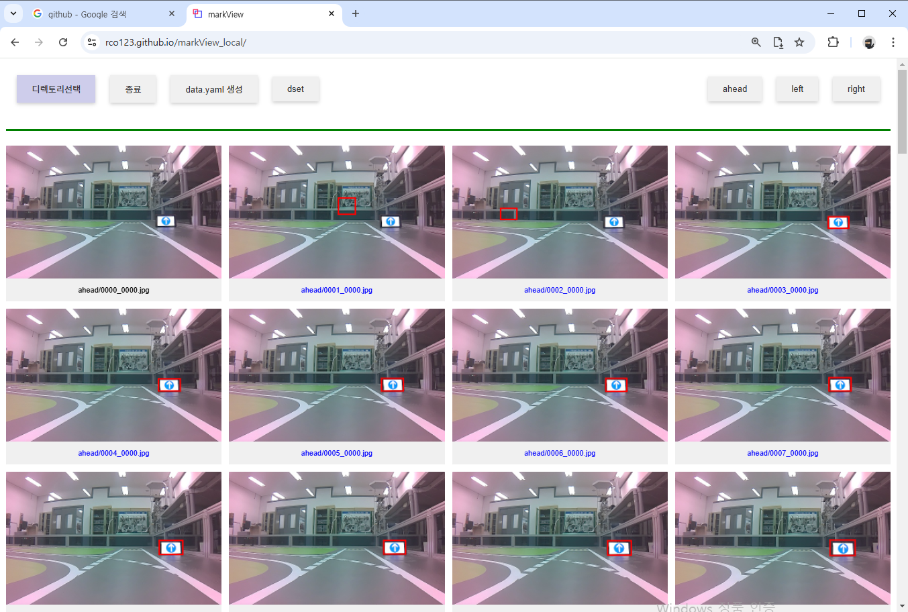

## markView_local(목적물 사각마킹 라벨 작업)

### 1.주요기능
- 이미지 안에 있는 디텍션 목적물을 사각 마킹을 지원한다.
- 마킹에 대한 yolo 라벨 txt 작성
- yolo 학습을 위한 라벨작업 지원
- 편리하고, 신속한 라벨 작업 지원
- 자동 data.yaml 생성 기능

### 2.이미지 라벨링
- 수집된 이미지가 aaa_bbb.jpg 인경우 , 해당 이름과 동일한 aaa_bbb.txt 파일생성
- 생성된 파일은 yolo 라벨에서 요구하는 class, 중심점 좌표, 가로 크기, 세로 크기 정보를 포함한다.

### 3.사용방법
- 제공된 dset 디렉토리에 있는 이미지 및 디렉토리 구조 참조
- 이미지를 상위 디렉토리 아래에 class 별 이미지 디렉토리를 생성하고, 해당 클래스의 이미지를 넣어 둔다.
- data.yaml 은 학습을 위한 데이터 생성 디렉토리 정보를 포함한다. 상단에 있는 생성버턴에 의해 자동 생성

### 4.마킹 방법
- 목적물에 해당하는 사각 박스의 좌측 상단 클릭하고, 우측하단 포인트를 클릭하면 박스가 생성되며 라벨의 위치정보를 포함하는 txt 파일이 자동 생성된다.

- 박스를 취소하는 경우, 해당 이미지를 두번 클릭하면, 박스가 초기화 된다.

### 5.프로그램 실행
https://rco123.github.io/markView_local/

### 6.동영상
https://youtu.be/U7Ebmj7EfeE

